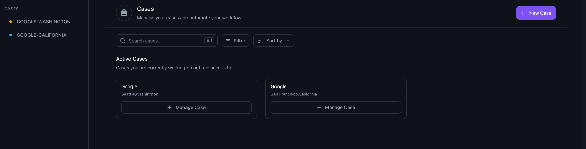
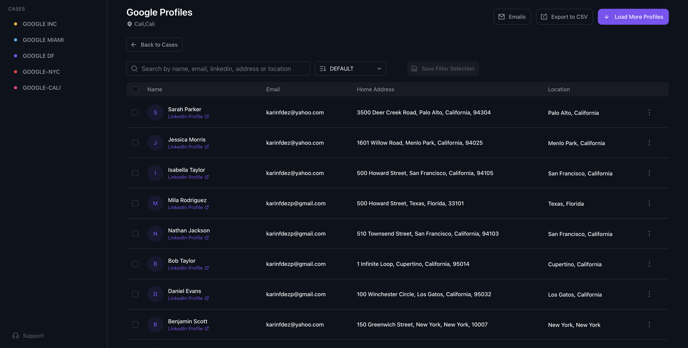
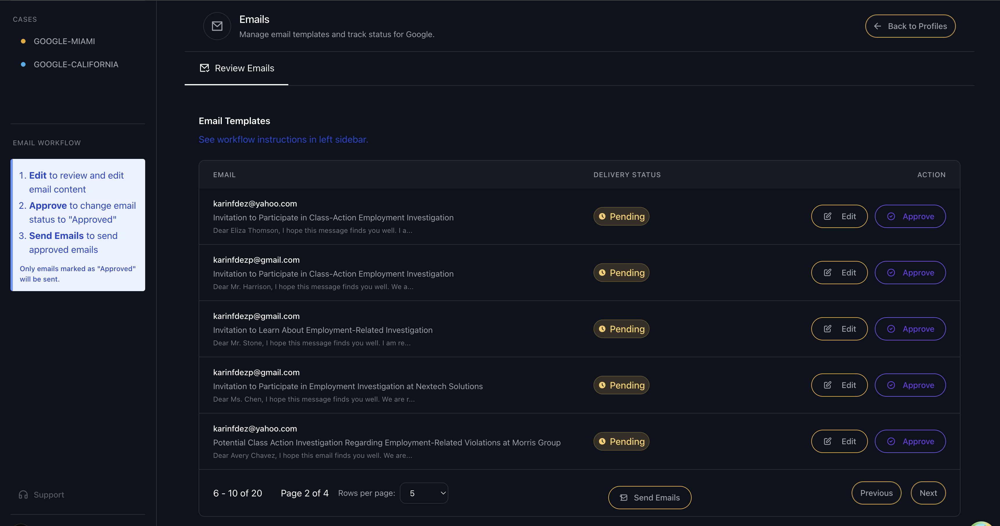

# Class Action: Employment Litigation Management

[](https://nextjs.org/)
[](https://www.typescriptlang.org/)
[](https://supabase.com/)
[](https://tailwindcss.com/)

## Project Overview

Class Action is a web platform designed to identify, contact, and recruit potential clients for employment class action lawsuits. The system enables law firms to search and fetch profiles of individuals based on their past job experience with a specific company, order and filter these profiles by relevant class action periods, and reach out to them directly via email. This platform connects individuals affected by workplace violations with law firms handling relevant class action litigation, streamlining the process of finding and engaging qualified participants.

---


### Business Problem Solved

Law firms struggle to efficiently identify and engage potential clients who may qualify for employment class action lawsuits, especially those who worked for a specific company during a relevant time period. This platform bridges the gap between affected individuals and legal representation by:

- **Profile Search & Filtering**: Fetches and organizes profiles of people who have previously worked for the analyzed (target) company, and allows searching/filtering by city, state (USA), etc
- **Class Period Filtering & Ordering**: Filters and sorts profiles based on the class action period and other eligibility criteria
- **Client Acquisition**: Identifies and organizes potential class action participants for targeted outreach
- **Targeted Outreach**: Connects affected individuals with appropriate legal representation through customized email communication
- **Automated Communication**: AI-powered email templates via Cloudflare Workers to inform potential clients of their legal options


## Screenshots & Demo

**Note:**  
_The application is privately hosted and not open for public access. For privacy and security reasons, I am providing a video demo below to showcase the platform’s features and user experience. If you would like a private walkthrough, please contact me directly.






[Watch the full demo here](YOUR_VIDEO_LINK)

---

## 🛠️ Technology Stack

### Frontend
- **Framework**: Next.js 14 (React 18)
- **Language**: TypeScript
- **Styling**: Tailwind CSS with custom components
- **State Management**: React Hooks and Jotai for global state
- **UI Components**: Radix UI primitives

### Backend & Infrastructure
- **Authentication**: Supabase Auth with Google OAuth
- **Database**: Supabase PostgreSQL
- **Email Service**: Custom email dispatcher via Cloudflare Workers
- **Deployment**: Netlify with CI/CD pipeline


## Application Structure

```
app/
├── (auth)/              # Authentication routes and components
├── (main)/              # Main application pages
│   ├── cases/           # Case management views
│   └── teams/           # Team collaboration features
├── api/                 # API routes for data handling
├── components/          # Reusable UI components
│   ├── ui/              # Base UI components
│   └── CompanyProfiles/ # Profile management components
├── context/             # React context providers
├── helpers/             # Utility functions
└── types/               # TypeScript type definitions
```

## Getting Started

```bash
# Install dependencies
npm install

# Run development server
npm run dev

# Open in browser
open http://localhost:3000
```

## Technologies

- **Frontend Framework**: Next.js 14 ko
- **UI Library**: React 18
- **Language**: TypeScript
- **Styling**: Tailwind CSS
- **Authentication**: Supabase Auth
- **State Management**: React Hooks & Jotai
- **Deployment**: Netlify

## Key Libraries

- **UI Components**: Radix UI (Dialog, Dropdown, Tabs, etc.)
- **Form Handling**: React Hook Form with Zod validation
- **Data Tables**: TanStack React Table
- **Date Handling**: date-fns
- **Animations**: Framer Motion
